# TradeArena — Entity Relationship Diagram

> **Stack**: Node.js · Express · MongoDB (Mongoose) · Virtual Paper Trading Platform

---

## ERD (Mermaid)

```mermaid
erDiagram

    USER {
        ObjectId _id PK
        string username UK
        string email UK
        string mobile UK
        string password
        string role "user | admin"
        boolean isEmailVerified
        boolean isMobileVerified
        string verificationCode
        string otp
        date otpExpires
        string kycStatus "pending | under_review | approved | rejected"
        number failedLoginAttempts
        date lockUntil
        string clientID UK
        string tradingAccountNumber UK
        number walletBalance
        number openingBalance
        number dailyClosedPnl
        string refreshToken
        date createdAt
        date updatedAt
    }

    KYC {
        ObjectId _id PK
        ObjectId user FK
        string fullName
        date dob
        string panNumber
        string aadhaarNumber
        string address
        string city
        string state
        string pincode
        string occupation
        string profilePhoto
        string panCard
        string aadhaarCard
        string status "pending | under_review | approved | rejected"
        string rejectionReason
        date createdAt
        date updatedAt
    }

    STOCK {
        ObjectId _id PK
        string symbol UK
        string companyName
        string exchange "NSE | BSE"
        string isin UK
        string sector
        string industry
        number marketCap
        string listingStatus "Active | Suspended"
        array indices
        number week52High
        number week52Low
        number currentPrice
        number prevClose
        number openPrice
        number highPrice
        number lowPrice
        number volume
        date createdAt
        date updatedAt
    }

    ORDER {
        ObjectId _id PK
        ObjectId user FK
        string symbol
        number quantity
        string orderType "market | limit | stop_loss | take_profit"
        string direction "buy | sell"
        number price
        number triggerPrice
        string status "pending | queued | executed | cancelled | rejected"
        number brokerage
        number stt
        number exchangeCharges
        number gst
        number sebiCharges
        number stampDuty
        number totalCharges
        string rejectionReason
        string executionProvider "paper | broker"
        boolean gtc
        date executedAt
        date createdAt
        date updatedAt
    }

    TRADE {
        ObjectId _id PK
        ObjectId user FK
        ObjectId order FK
        string symbol
        number executionPrice
        number executionQuantity
        string direction "buy | sell"
        number brokerage
        number stt
        number exchangeCharges
        number gst
        number sebiCharges
        number stampDuty
        number totalCharges
        date timestamp
        date createdAt
        date updatedAt
    }

    HOLDING {
        ObjectId _id PK
        ObjectId user FK
        string symbol
        number quantity
        number averageBuyPrice
        number totalCost
        date createdAt
        date updatedAt
    }

    POSITION {
        ObjectId _id PK
        ObjectId user FK
        string symbol
        number quantity
        number buyQty
        number sellQty
        number averageBuyPrice
        number averageSellPrice
        number realizedPnl
        date createdAt
        date updatedAt
    }

    LEDGER {
        ObjectId _id PK
        ObjectId user FK
        number amount
        string type "deposit | withdrawal | trade_debit | trade_credit | charges | dividend | other"
        string status "pending | completed | failed"
        number balanceAfter
        string description
        string referenceId
        date createdAt
        date updatedAt
    }

    IPO {
        ObjectId _id PK
        string companyName
        string symbol UK
        string priceRange
        number minQuantity
        date openDate
        date closeDate
        date listingDate
        string status "open | closed | allotted | listed"
        date createdAt
        date updatedAt
    }

    IPO_APPLICATION {
        ObjectId _id PK
        ObjectId user FK
        ObjectId ipo FK
        number appliedQuantity
        number appliedPrice
        string status "applied | allotted | not_allotted | cancelled"
        number fundsBlocked
        date createdAt
        date updatedAt
    }

    WATCHLIST {
        ObjectId _id PK
        ObjectId user FK
        string name
        array stocks
        date createdAt
        date updatedAt
    }

    JOURNAL {
        ObjectId _id PK
        ObjectId user FK
        ObjectId trade FK
        string symbol
        string entryReason
        string exitReason
        string strategy
        string notes
        string learnings
        date createdAt
        date updatedAt
    }

    NOTIFICATION {
        ObjectId _id PK
        ObjectId user FK
        string title
        string message
        string type "order | price | wallet | system"
        boolean isRead
        date timestamp
        date createdAt
        date updatedAt
    }

    AUDIT_LOG {
        ObjectId _id PK
        ObjectId user FK
        string action
        string ipAddress
        string details
        date timestamp
    }

    REPORT {
        ObjectId _id PK
        ObjectId user FK
        string type "contract_note | daily_summary"
        string date
        string pdfPath
        string pdfUrl
        boolean emailSent
        date createdAt
        date updatedAt
    }

    %% ─── Relationships ───────────────────────────────────────────────────────

    USER ||--o| KYC             : "has one"
    USER ||--o{ ORDER           : "places"
    USER ||--o{ TRADE           : "executes"
    USER ||--o{ HOLDING         : "holds"
    USER ||--o{ POSITION        : "has"
    USER ||--o{ LEDGER          : "has entries"
    USER ||--o{ IPO_APPLICATION : "applies for"
    USER ||--o{ WATCHLIST       : "owns"
    USER ||--o{ JOURNAL         : "writes"
    USER ||--o{ NOTIFICATION    : "receives"
    USER ||--o{ AUDIT_LOG       : "generates"
    USER ||--o{ REPORT          : "owns"

    ORDER ||--o{ TRADE          : "results in"
    TRADE ||--o| JOURNAL        : "documented by"

    IPO   ||--o{ IPO_APPLICATION : "receives"
```



---

## Relationships at a Glance

| Relationship | Type | Description |
|---|---|---|
| **User → KYC** | One-to-One | Each user has exactly one KYC record |
| **User → Order** | One-to-Many | A user can place many orders |
| **User → Trade** | One-to-Many | A user can have many executed trades |
| **User → Holding** | One-to-Many | A user can hold multiple stocks (per symbol) |
| **User → Position** | One-to-Many | A user has intraday positions per symbol |
| **User → Ledger** | One-to-Many | Every wallet event creates a ledger entry |
| **User → IPOApplication** | One-to-Many | A user can apply for multiple IPOs |
| **User → Watchlist** | One-to-Many | A user can have multiple named watchlists |
| **User → Journal** | One-to-Many | A user can write multiple trade journals |
| **User → Notification** | One-to-Many | A user receives many notifications |
| **User → AuditLog** | One-to-Many | Security & activity trail per user |
| **User → Report** | One-to-Many | PDF reports (contract notes, daily summaries) |
| **Order → Trade** | One-to-Many | One executed order generates one or more trades |
| **Trade → Journal** | One-to-One (optional) | A trade can optionally be annotated in a journal |
| **IPO → IPOApplication** | One-to-Many | Many users can apply against one IPO |

---

## Entity Groups

```
┌─────────────────────────────────────────────────────────────────────────┐
│  CORE IDENTITY                                                          │
│  User  ·  KYC                                                           │
├─────────────────────────────────────────────────────────────────────────┤
│  MARKET DATA                                                            │
│  Stock                                                                  │
├─────────────────────────────────────────────────────────────────────────┤
│  TRADING FLOW                                                           │
│  Order  →  Trade  →  Holding / Position                                 │
├─────────────────────────────────────────────────────────────────────────┤
│  FINANCE                                                                │
│  Ledger  ·  Report                                                      │
├─────────────────────────────────────────────────────────────────────────┤
│  IPO MODULE                                                             │
│  IPO  ·  IPOApplication                                                 │
├─────────────────────────────────────────────────────────────────────────┤
│  USER TOOLS                                                             │
│  Watchlist  ·  Journal  ·  Notification                                 │
├─────────────────────────────────────────────────────────────────────────┤
│  ADMIN / SECURITY                                                       │
│  AuditLog                                                               │
└─────────────────────────────────────────────────────────────────────────┘
```

---

> **Note**: `symbol` fields in Order, Trade, Holding, Position, Watchlist, and Journal act as a **soft reference** to the Stock collection (not a hard ObjectId FK). This is by design for performance and immutability of historical records.
